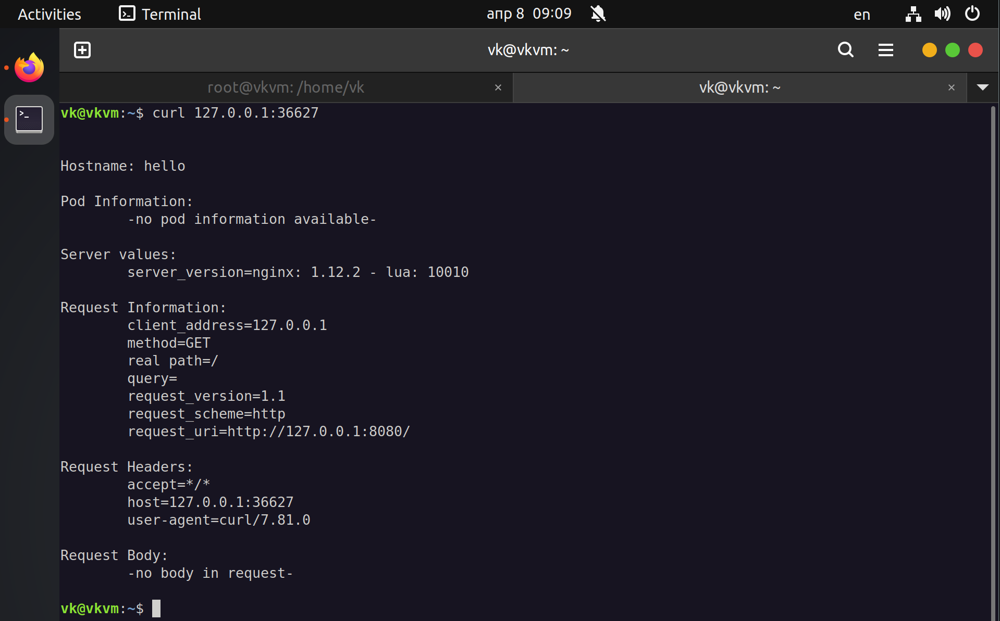
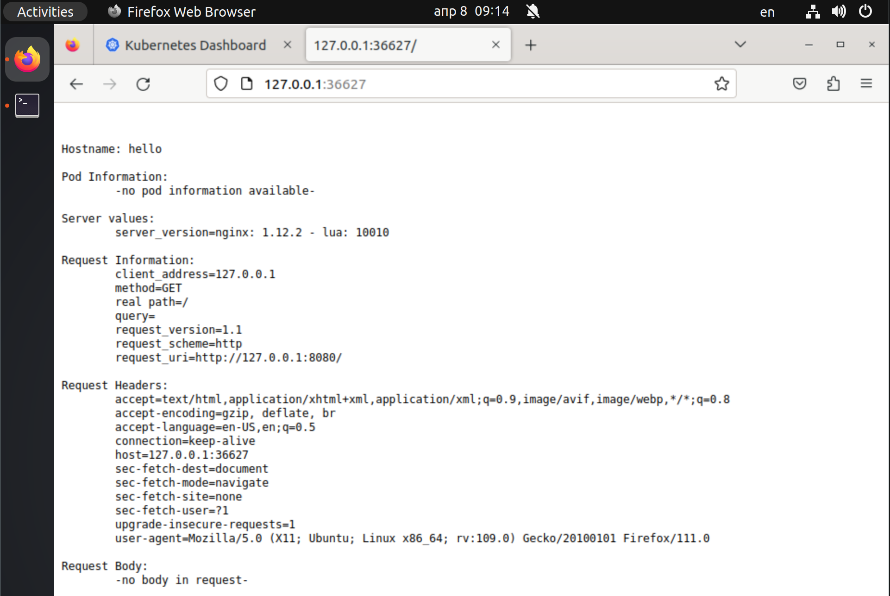
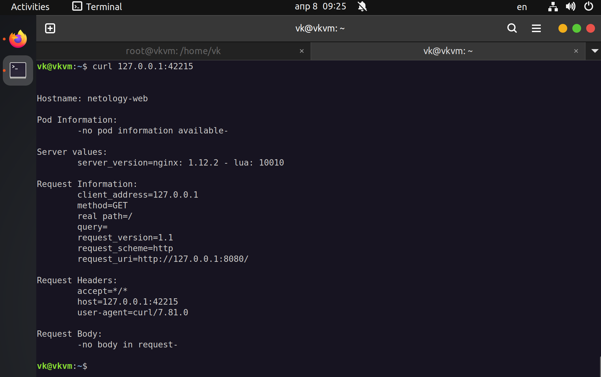
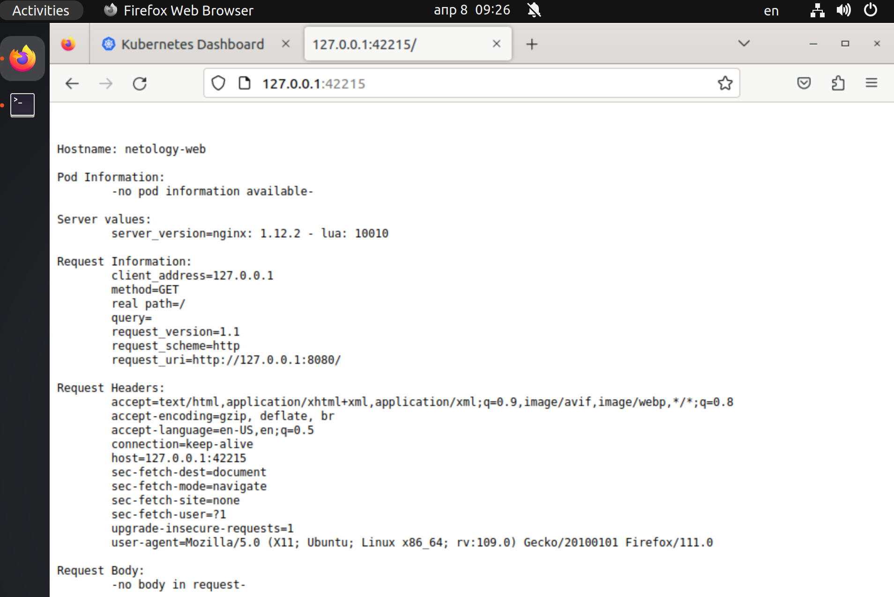

# devops-DZ12.2-K8S-Objects
# Домашнее задание к занятию «Базовые объекты K8S»

### Цель задания

В тестовой среде для работы с Kubernetes, установленной в предыдущем ДЗ, необходимо развернуть Pod с приложением и подключиться к нему со своего локального компьютера.

------

### Чеклист готовности к домашнему заданию

1. Установленное k8s-решение (например, MicroK8S).
2. Установленный локальный kubectl.
3. Редактор YAML-файлов с подключенным Git-репозиторием.

------

### Инструменты и дополнительные материалы, которые пригодятся для выполнения задания

1. Описание [Pod](https://kubernetes.io/docs/concepts/workloads/pods/) и примеры манифестов.

2. Описание [Service](https://kubernetes.io/docs/concepts/services-networking/service/).

------

### Задание 1. Создать Pod с именем hello-world

1. Создать манифест (yaml-конфигурацию) Pod.
2. Использовать image - gcr.io/kubernetes-e2e-test-images/echoserver:2.2.
3. Подключиться локально к Pod с помощью `kubectl port-forward` и вывести значение (curl или в браузере).

------

### Задание 2. Создать Service и подключить его к Pod

1. Создать Pod с именем netology-web.
2. Использовать image — gcr.io/kubernetes-e2e-test-images/echoserver:2.2.
3. Создать Service с именем netology-svc и подключить к netology-web.
4. Подключиться локально к Service с помощью `kubectl port-forward` и вывести значение (curl или в браузере).

------

### Правила приёма работы

1. Домашняя работа оформляется в своем Git-репозитории в файле README.md. Выполненное домашнее задание пришлите ссылкой на .md-файл в вашем репозитории.
2. Файл README.md должен содержать скриншоты вывода команд `kubectl get pods`, а также скриншот результата подключения.
3. Репозиторий должен содержать файлы манифестов и ссылки на них в файле README.md.
 
------

### Критерии оценки

Зачёт — выполнены все задания, ответы даны в развернутой форме, приложены соответствующие скриншоты и файлы проекта, в выполненных заданиях нет противоречий и нарушения логики.
На доработку — задание выполнено частично или не выполнено, в логике выполнения заданий есть противоречия, существенные недостатки.

----

## Ответ

### Задание 1

##### MicroK8S установлен

```shell
root@vkvm:/home/vk# microk8s kubectl get nodes
NAME   STATUS   ROLES    AGE   VERSION
vkvm   Ready    <none>   36h   v1.26.3

root@vkvm:/home/vk# microk8s kubectl get pod -A
NAMESPACE     NAME                                        READY   STATUS    RESTARTS        AGE
kube-system   kubernetes-dashboard-dc96f9fc-m949s         1/1     Running   2 (3m54s ago)   36h
kube-system   dashboard-metrics-scraper-7bc864c59-7dspr   1/1     Running   2 (3m54s ago)   36h
kube-system   metrics-server-6f754f88d-qlllr              1/1     Running   2 (3m54s ago)   36h
kube-system   calico-kube-controllers-79568db7f8-jk9ck    1/1     Running   2 (3m54s ago)   36h
kube-system   calico-node-tl7rj                           1/1     Running   2 (3m54s ago)   36h
```

#### `POD-echoserver.yml` файл с конфигурацией


```yml
apiVersion: v1
kind: Pod
metadata:
    name: hello
    labels:
        app: hello
spec:
    containers:
    - name: hello
      image: gcr.io/kubernetes-e2e-test-images/echoserver:2.2
      ports:
      - containerPort: 8080
```


#### Применим конфигурацию

```shell
root@vkvm:/home/vk# kubectl create -f POD-echoserver.yml
pod/hello created
```

#### Проверим Pod

```shell
root@vkvm:/home/vk# kubectl get pod
NAME    READY   STATUS    RESTARTS   AGE
hello   1/1     Running   0          2m33s
root@vkvm:/home/vk# kubectl port-forward hello :8080
Forwarding from 127.0.0.1:44251 -> 8080
Forwarding from [::1]:44251 -> 8080    

vk@vkvm:~$ curl 127.0.0.1:36627


Hostname: hello

Pod Information:
	-no pod information available-

Server values:
	server_version=nginx: 1.12.2 - lua: 10010

Request Information:
	client_address=127.0.0.1
	method=GET
	real path=/
	query=
	request_version=1.1
	request_scheme=http
	request_uri=http://127.0.0.1:8080/

Request Headers:
	accept=*/*  
	host=127.0.0.1:36627  
	user-agent=curl/7.81.0  

Request Body:
	-no body in request-

```



#### Удалим Pod

```shell
root@vkvm:/home/vk# kubectl delete -f POD-echoserver.yml 
pod "hello" deleted
```

### Задание 2

#### `POD-netology.yml` с конфигурацией для пода

```yml
apiVersion: v1
kind: Pod
metadata:
    name: netology-web
    labels:
        app: netology-web
spec:
    containers:
      - name: netology-web
        image: gcr.io/kubernetes-e2e-test-images/echoserver:2.2
        ports:
         - containerPort: 8080
```


#### `SERVICE-netology.yml` файл с конфигурацией для сервиса
    ```yml
    apiVersion: v1
    kind: Service
    metadata:
      name: netology-svc
    spec:
      ports:
        - name: echoserver
          port: 80
          protocol: TCP
          targetPort: 8080
      selector:
        app: netology-web
    ```


#### Применим конфигурацию

```shell
root@vkvm:/home/vk# kubectl apply -f POD-netology.yml -f SERVICE-netology.yml
pod/netology-web created
service/netology-svc created
```

#### Проверим Pod и Service

```shell
root@vkvm:/home/vk# kubectl get pod
NAME           READY   STATUS    RESTARTS   AGE
netology-web   1/1     Running   0          28s

root@vkvm:/home/vk# kubectl get service
NAME           TYPE        CLUSTER-IP      EXTERNAL-IP   PORT(S)   AGE
kubernetes     ClusterIP   10.152.183.1    <none>        443/TCP   37h
netology-svc   ClusterIP   10.152.183.62   <none>        80/TCP    36s

root@vkvm:/home/vk# kubectl port-forward service/netology-svc :80
Forwarding from 127.0.0.1:42215 -> 8080
Forwarding from [::1]:42215 -> 8080

vk@vkvm:~$ curl 127.0.0.1:42215


Hostname: netology-web

Pod Information:
	-no pod information available-

Server values:
	server_version=nginx: 1.12.2 - lua: 10010

Request Information:
	client_address=127.0.0.1
	method=GET
	real path=/
	query=
	request_version=1.1
	request_scheme=http
	request_uri=http://127.0.0.1:8080/

Request Headers:
	accept=*/*  
	host=127.0.0.1:42215  
	user-agent=curl/7.81.0  

Request Body:
	-no body in request-
```




#### Удалим Pod и Service

```shell
root@vkvm:/home/vk# kubectl delete -f POD-netology.yml -f SERVICE-netology.yml
pod "netology-web" deleted
service "netology-svc" deleted
```
